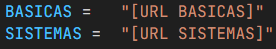
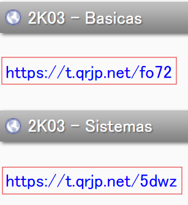
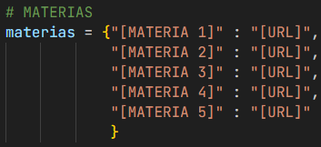

Para configurar este programa, seguir estos pasos:

# 1. Configurar el JSON

Dentro del json, está dividido por día, dentro de cada día una materia con su nombre, hora de inicio y hora de fin está anotada. La data que se encuentra predeterminada es la mia no me doxeen.

Para configurarlo, se debe cambiar el nombre de la materia en el archivo ***horario.json***, se pueden utilizar los datos como referencia.  **IMPORTANTE** recordar la sintaxis utlizada ya que se reutilizará más adelante.

Además de los nombres, se debe cambiar la fecha de inicio y fin de cada una, para permitir la actualización automática en base a la hora actual.

**NO CAMBIAR LOS NOMBRES DE LOS DIAS**

# 2. Configurar las materias

En el principio del archivo ***materias.py*** <br>  <br> se deben ingresar los links suministrados por la pagina del QR, 



Luego, en la sección de materias se debe ingresar el nombre de cada materia ***con la misma sintaxis que en horarios.json*** y los url para el formulario de la respectiva materia <br>



# 3. Ingresar nombres

Por último, se debe ingresar la lista de apellidos a los que se les quiere ingresar la asistencia. En el archivo materias, se debe rellenar la lista con strings en el siguiente formato:

```
nombres = ["Perez", "Gomez", "Hernandez"]
```


# 4. Ejecutarlo

Ejecutá el main.py y dejalo hacer su magia.

# 5. Disfrutar xd


Bueno chavales espero que les haya molado suscribios y dadle a la estrellita para no perdeos ningun readme.

